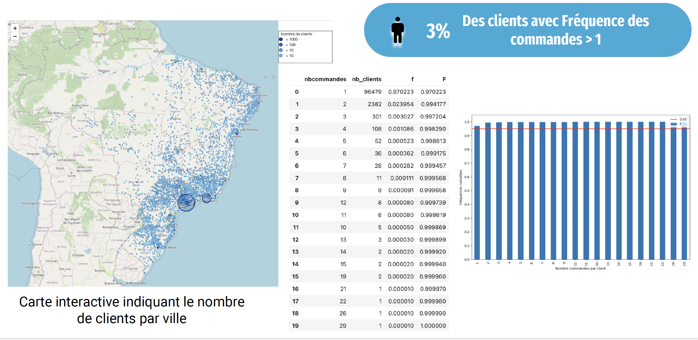
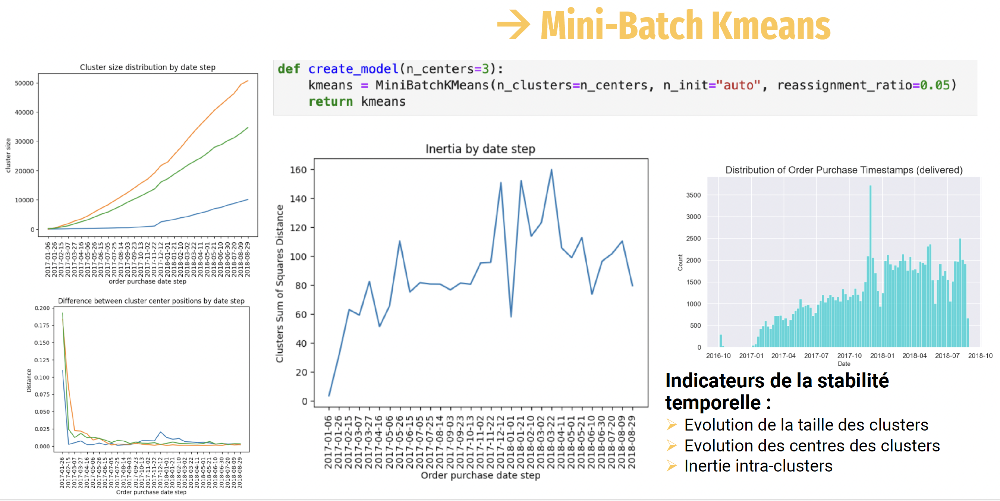

# demo_ML_marketing

# Demonstration of a customer Segmentation for an E-Commerce Site

## Project Overview
This project focuses on segmenting customers of a Brazilian e-commerce company using unsupervised learning techniques. The goal is to understand different types of users based on their behavior and personal data to target marketing campaigns effectively.

## Problem Statement
The primary objectives are:
- To understand the various types of users through their behavior and personal data.
- To address targeted marketing campaigns.

## Data Description
The dataset, sourced from Kaggle, includes anonymized customer data with order histories, purchased products, satisfaction comments, and customer locations. The data spans from October 2016 to August 2018.

### Data Features
1. **Order Features**: Dates, amounts, payment types, deliveries, satisfaction scores, etc.
2. **Customer Features**: Locations.
3. **Product Features**: Vendor details, types, prices, etc.

The dataset was unified into a comprehensive table containing all orders and customer data.

## Exploratory Data Analysis
The exploratory analysis involved:
- Examining order distributions, with a majority of orders delivered and amounts clustered between 100 and 200 BRL.
- Analyzing payment methods, where 74% of payments were made by credit card.
- Identifying top-selling and least-selling products.
- Investigating customer behaviors, revealing that only 3% of customers placed more than one order.
- Visualizing customer distribution across cities, with São Paulo and Rio de Janeiro having the highest concentrations.

 

## Feature Engineering
Key steps in feature engineering included:
- Creating new features like Recency, Frequency, and Monetary (RFM) values.
- Removing outliers and applying transformations to improve feature distributions.
- Generating RFM scores for customer segmentation.

## Modeling Approach
Several unsupervised learning algorithms were evaluated, with MiniBatchKMeans selected for its efficiency in handling large datasets. The modeling approach included:
- Using MiniBatchKMeans for clustering.
- Evaluating cluster stability over time to inform the maintenance contract.

 

### Clustering Results
The RFM analysis produced three clusters:
1. **Bronze**: New clients with low Recency and Monetary values, providing opportunities to convert them into loyal customers through targeted marketing.
2. **Silver**: Loyal customer base with moderate Recency and Monetary values, where marketing should focus on loyalty programs.
3. **Gold**: High-value, less frequent buyers, where marketing should target product recommendations to maximize spending.

## Conclusion
The segmentation model provides a robust framework for understanding customer behaviors and tailoring marketing strategies to different customer segments. The stability analysis suggests that periodic re-training of the model is necessary, particularly during high-order periods like year-end holidays.

## How to Use
1. Clone the repository.
2. Install the necessary dependencies from `requirements.txt`.
3. Run the data preprocessing script to prepare the dataset.
4. Execute the modeling notebook to train and evaluate the segmentation model.
5. Generate reports and visualizations to interpret the results.

For more detailed instructions, refer to the respective notebooks and scripts in the repository.

## Acknowledgements
- This project was completed as part of a data science training program. The dataset was sourced from Kaggle, and all analyses were conducted using Python and relevant data science libraries.
- Special thanks to the instructors and peers for their valuable feedback and support.

## Author
Audrey Hohmann, OpenclassRoom student : Data Scientist training path
